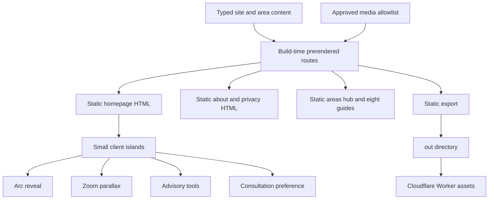
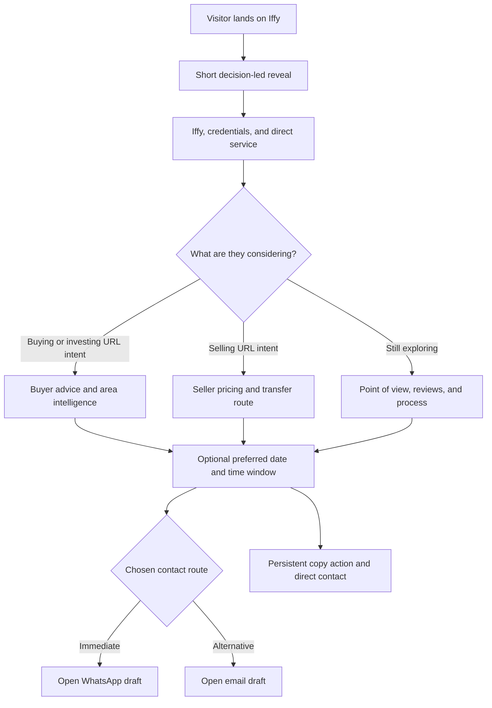
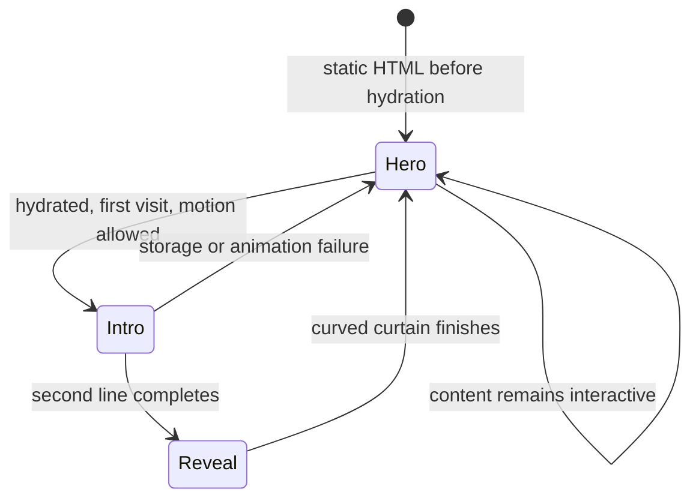

# feat: Rebuild Iffy landing experience around trusted advice

## Summary

Rebuild the Iffy site as a statically exported Next.js application that preserves every current public route while giving the homepage a new mobile-first narrative. The 21st components become the signature interaction system: a short arc reveal, one zoom-parallax story, selective liquid-glass controls, and a consultation date-preference flow.

The visual direction is image-led, technically sharp, and human. It uses only repository photography and video, puts Iffy and his credentials near the top, gives buying and selling equal weight, and removes the current reliance on bordered cards, repeated eyebrow labels, and long stretches of hidden scroll content.

---

## Problem Frame

The current site contains useful area guides, candid advisory copy, working calculators, direct contact routes, and a substantial local media library. Its homepage is also very long, buyer-heavy, visually repetitive, and fragile under scroll-reveal behavior. Iffy appears after several screens, credentials and review provenance are buried, and the primary action says “Book Consultation” even though the site only opens a form or WhatsApp.

The redesign must increase trust and inbound intent without turning Iffy into a property portal. Motion should create one memorable first impression, then get out of the way. The user should understand within the first two mobile viewports that Iffy serves buyers and sellers, is licensed and reachable, gives candid advice, and can be contacted directly.

---

## Requirements

### Experience and visual direction

- R1. The homepage must be mobile-first and remain complete at desktop widths without becoming a centered template stack.
- R2. The attached 21st arc reveal, zoom parallax, liquid glass, and calendar concepts must appear in adapted production components.
- R3. On an eligible hydrated first visit, the optional arc overlay must use “Buy properly.” and “Sell with confidence.” over the fail-open static Iffy hero, with controls usable within 1.8 seconds.
- R4. Iffy must be the dominant human presence in the hero, using repository media rather than stock or Figma-exported imagery.
- R5. The page must use no repeated eyebrow labels, bordered content cards, gradient text, purple glow, or decorative glass containers.
- R6. Motion must be transform and opacity based, purposeful, interruptible, and replaced with a coherent static composition when reduced motion is requested.

### Trust and content

- R7. Buying and selling must be equal first-order routes; investing remains a buying objective rather than a third competing service card.
- R8. Licence 91889, Kamani Living ORN 1247700, the Dubai Hills office, and direct personal service must appear near the top as a borderless trust ledger.
- R9. Existing candid copy and verified repo claims must be preserved where useful, while invented awards, listings, metrics, seller proof, or scheduling availability are forbidden.
- R10. Existing testimonials may be reused only with their current attribution; the redesign must not imply third-party verification that the repository does not provide.
- R11. The eight area guides, About page, privacy content, calculators, contact details, metadata, structured data, sitemap, robots rules, and branded 404 behavior must survive the migration.

### Conversion

- R12. “Talk to Iffy” must be the single primary route into consultation and must carry buying, investing, selling, or not-sure intent through a normal URL and anchor; WhatsApp and email are final channel actions, with “WhatsApp now” available as a secondary bypass.
- R13. The optional calendar must collect a preferred date and broad Dubai-time window, not claim to show availability, reserve a slot, or confirm an appointment.
- R14. The consultation flow must never claim that a message was sent. It must always expose the generated draft, a copy action, Iffy’s direct address and number, and neutral guidance that the visitor still needs to send any opened external draft.
- R15. The existing advisory tools must remain available but move below the core trust narrative and use progressive disclosure instead of a bordered dashboard panel.
- R20. Unsupported “Book Consultation”, “booked”, “confirmed”, and “sent” language must be removed from shared navigation, every public route, accessible labels, metadata, and structured data.
- R21. At 390x844 after the arc completes, the hero, compact trust ledger, and both buyer and seller route headings/actions must appear within two viewport heights.

### Platform, accessibility, and performance

- R16. The delivered site must statically render crawlable HTML for every current public route and remain deployable through the existing Cloudflare Worker asset model.
- R17. Only repository images and video may ship; Figma assets, Unsplash, and remote demo imagery are excluded.
- R18. The site must target WCAG 2.2 AA for keyboard behavior, semantic controls, focus visibility, contrast, form labeling, 44px minimum touch targets, and reduced motion.
- R19. Initial mobile delivery must not request the 14.2 MB advisor film before an explicit play action, must defer other non-critical media, and must prevent scroll effects from producing blank page regions while content waits to reveal.

---

## Experience Blueprint

| Sequence | Planned copy and purpose | Repository media | Interaction treatment |
|---|---|---|---|
| 1. Arc intro | “Buy properly.” then “Sell with confidence.” | None | Adapted `ArcRevealHero`, once per session, instant reduced-motion exit |
| 2. Full-bleed hero | The arc resolves into the full-bleed “IFFY” identity. Supporting line: “Advice you can hold me to.” Body: “Direct property guidance across Dubai and Abu Dhabi, from the first shortlist or valuation to handover and transfer.” CTAs: “Talk to Iffy” and “See how I work” | LCP still: `iffy-laptop.webp`; portrait enhancement after LCP: `iffy-hero.mp4`; fallback: `fallback-iffy.jpg` | Image-led hero with liquid-glass CTAs only where contrast is stable |
| 3. Trust ledger | “Licensed property advisor”, “Through Kamani Living”, “Dubai Hills Business Park”, “You deal with Iffy directly” | No new image | Borderless type ledger, horizontal on wide screens and stacked on mobile |
| 4. Buying and selling | “Know what you’re buying into.” and “Sell with the facts on your side.” | `hero-interior.webp` and a neutral approved property image | Two normal links that carry intent into the consultation anchor; no guest image may imply seller proof |
| 5. Advisor point of view | “The recommendation has to be right, even when it costs a sale.” Supporting film copy introduces Iffy’s path from Manchester and retail banking to six years investing in UK property and advising in Dubai. | `iffy-film.mp4`; an approved clean opening frame becomes a lightweight portrait poster, with `fallback-iffy.jpg` as the no-video fallback | Editorial copy beside an on-demand 94-second “Meet Iffy” film. Render the pillarboxed source through a stable central portrait crop, attach it only after explicit play, and provide native controls, captions/transcript, no autoplay, and no decorative looping. |
| 6. Client proof | “Straight answers. No pressure.” plus one existing review at a time | No adjacent guest portrait unless the subject and review relationship are verified | Large typographic testimonial treatment with no card or carousel chrome |
| 7. Market perspective | “The right area is both a financial decision and a life decision.” | Central `hero-downtown.webp`; supporting `hero-marina.webp`, `hero-palm.webp`, `hero-interior.webp`, `dubai-hills.webp`, `saadiyat.webp`, `business-bay.webp` | Seven-image desktop story; at most three composited mobile images; all seven appear in the static mosaic |
| 8. Advisory process | “From first call to keys.” | Optional `iffy-laptop.webp` detail crop | One numbered rail: objective, evidence, recommendation, completion, aftercare |
| 9. Area intelligence | “Start with the objective, not the postcode.” | Existing area WebPs | One featured area at a time, with links into all eight existing guides |
| 10. Buyer tools | “Useful starting points, not final advice.” | CSS-only limestone surface with a pale Gulf-blue radial gradient and subtle grid | Borderless progressive disclosure for the existing area, budget, and off-plan tools |
| 11. Consultation | “Tell Iffy what you’re considering.” Helper: “Choose a preferred day and Dubai-time window, or message without choosing a time. Iffy will reply to agree the exact time.” CTAs: “Continue on WhatsApp”, “Draft an email”, and “Message without a time” | `hero-interior.webp` as an optional low-contrast background crop | Optional glass date preference, route selector, time window, and external draft handoff with copy fallback |
| 12. Legal close | Direct phone, email, Instagram, licence, ORN, office, disclaimer, privacy | Existing favicon and wordmark treatment | Dense but readable footer; no newsletter or invented social proof |

### Media loading boundaries

- `iffy-film.mp4` is relevant trust material: it covers Iffy’s background, property-investing experience, move to Dubai, recent client work, family connection to Kamani, and work ethic. It may ship only as the on-demand “Meet Iffy” film in the advisor section; the browser must receive a lightweight poster instead of the MP4 until the visitor chooses Play.
- The film’s baked-in social captions do not replace an accessible transcript or timed text track. Any transcript used in production must be checked against the audio rather than copied blindly from automatic speech recognition.
- The Palm before/complete/lifestyle sequence remains available for a later editorial story or area guide rather than competing with the zoom-parallax signature.
- Developer renders such as `the-wilds.webp` and `dubai-islands.webp` remain in their existing factual contexts until publication rights are confirmed.
- Existing JPG counterparts remain fallbacks or social assets; WebP is preferred for rendered page media.

---

## 21st Component Adaptations

### Arc reveal

- Keep the progress-driven curved SVG reveal and session replay suppression.
- Replace eight generic greetings with the two confirmed Iffy lines.
- Keep the static hero visible in server HTML and mount the intro overlay only after hydration and eligibility checks.
- Make the intro decorative to assistive technology, hold hero controls inert only while the overlay is active, and guarantee focus restoration and inert cleanup on completion, skip, or failure.
- Make hero controls usable within 1.8 seconds, with pointer and keyboard skip behavior.
- Use dynamic viewport units and skip immediately for reduced motion, replayed sessions, storage failures, Motion failures, or interrupted hydration.

### Liquid glass

- Keep the visual idea, but replace the supplied clickable `div` with real links and buttons.
- Remove the dock, remote icons, padding-based hover growth, overshooting easing, and mandatory turbulence filter.
- Use translucent fill, restrained backdrop blur, a light-catching inner highlight, and a solid high-contrast fallback.
- Limit the effect to hero actions, the consultation action, and at most one mobile navigation control.

### Zoom parallax

- Keep one scroll-linked scale story and remove the current competing four-scene sticky morph.
- Use the seven mapped repository images, a scale ceiling of 4x, and a sticky length no greater than 240svh on wide screens.
- On phones, animate no more than three composited images across at most 160svh, then expose the remaining imagery in the static composition.
- Disable sticky treatment in short landscape, with reduced motion, or when the viewport is too constrained. Text and CTAs never depend on parallax completion.

### Consultation calendar

- Remove the inert Weekly/Monthly tabs, Settings, Add note, and New Event controls.
- Replace the horizontally scrolling month with a compact, keyboard-operable preferred-date picker and a short Dubai-time-window selector.
- Allow tomorrow through 60 Dubai calendar days ahead, revalidate at submission, format the date unambiguously, and provide a narrow-width native-date fallback where seven 44px columns cannot fit.
- Support arrow keys, Home/End, Page Up/Page Down, month announcements, selected-date announcements, and focus retention across month changes.
- Pass intent, name, optional date, optional time window, and contact route into the WhatsApp or email draft. Do not require phone and email fields or imply live availability.

---

## Key Technical Decisions

- KTD1. Use Next.js with static export, TypeScript, Tailwind CSS, and the shadcn project structure. The build emits `out/` as the only deployable artifact; Wrangler serves `./out` with `auto-trailing-slash` and `404-page`, while Next keeps non-trailing-slash output to preserve current clean canonicals.
- KTD2. Do not use React Native or Expo. They require rewrites of the DOM, SVG, Tailwind, and browser-storage 21st components without improving this web-only experience. Astro with React islands is viable, but Next is selected because the nav, four 21st primitives, three tools, and consultation flow can share one React/shadcn model without cross-island coordination.
- KTD3. Use Server Components statically prerendered at build time, not request-time rendering. Exclude request-time cookies and headers, Server Actions, runtime route handlers, redirects, and default image optimization; generate exactly the eight known area slugs at build time.
- KTD4. Normalize animation imports on `motion/react`. Do not install both `framer-motion` and `motion`.
- KTD5. Preserve the existing URL and SEO contract before removing legacy HTML. Route parity is a migration gate, not a cleanup task.
- KTD6. Retain Geist as the single type family because it is already part of the site identity. Create hierarchy through scale, weight, tracking, and art direction rather than adding a reflex display serif.
- KTD7. Shift the palette from category-default black and gold to warm ink, limestone, Gulf-blue/sea-glass, and sand. Existing gold becomes a minor credential detail; purple is excluded.
- KTD8. Treat “no bordered cards” as a content-layout rule. Form fields and focus indicators retain necessary affordances, but sections, testimonials, service routes, area previews, and tools do not sit inside repeated outlined containers.
- KTD9. Keep lead handling client-side unless a real scheduling or CRM integration is separately authorized. This preserves the current privacy promise and prevents a cosmetic calendar from becoming a false booking system.
- KTD10. Progressive enhancement fails open. Base HTML and CSS show complete content; client code may opt into hidden animation starts only after observers, skip handlers, and cleanup are ready.
- KTD11. A typed media manifest is the shipping allowlist. It records route use, dimensions, byte size, loading policy, fallback, and provenance status. Unused duplicates never enter `out/`; `iffy-film.mp4` is the named exception only when it has one on-demand advisor-film placement, a lightweight poster, and a verified transcript/caption asset.

---

## High-Level Technical Design

### Static route and client-island topology



### Landing-page decision flow



### Hero motion lifecycle



---

## Output Structure

```text
app/
  about/page.tsx
  areas/[slug]/page.tsx
  areas/page.tsx
  globals.css
  layout.tsx
  not-found.tsx
  page.tsx
  privacy/page.tsx
  robots.ts
  sitemap.ts
components/
  landing/
  site/
  tools/
  ui/
content/
  area-guides.ts
  media.ts
  site.ts
lib/
  lead.ts
  utils.ts
public/
  _headers
  media/
tests/
  e2e/
  fixtures/
  unit/
```

Legacy HTML stays in place until route and content parity is proven. Its removal is the final migration action, not the first.

---

## Implementation Units

### U8. Freeze the legacy behavior contract

- **Goal:** Record a reproducible baseline before framework files or route sources move.
- **Requirements:** R9, R10, R11, R14, R16, R20.
- **Dependencies:** None.
- **Files:** `tests/fixtures/legacy-routes.json`, `tests/fixtures/legacy-tools.json`, `tests/fixtures/legacy-leads.json`, `tests/fixtures/legacy-media.json`.
- **Approach:** Capture path variants, redirects, status, canonical metadata, schema fields, major headings, anchors, contact destinations, calculator cases, lead-message templates, robots, sitemap, 404 behavior, and referenced media in versioned fixtures.
- **Patterns to follow:** Current behavior in `index.html`, `about.html`, `privacy.html`, `404.html`, `areas/*.html`, `sitemap.xml`, and `robots.txt`.
- **Test scenarios:**
  - Every current clean URL and its relevant path variants have an expected status, canonical, title, description, and primary heading.
  - Representative inputs for each calculator have expected outputs and caveats.
  - Buying, investing, selling, and generic enquiries have expected WhatsApp and email draft content.
  - The media baseline identifies every referenced asset and every stored but unused duplicate.
- **Verification:** The migration can be judged against an immutable oracle after legacy source files are removed.

### U1. Establish the static React foundation and design contract

- **Goal:** Create the Next.js, TypeScript, Tailwind, shadcn, test, and static-export foundation without changing the public URL contract.
- **Requirements:** R1, R5, R16, R17, R18, R19.
- **Dependencies:** U8.
- **Files:** `package.json`, `next.config.ts`, `tsconfig.json`, `postcss.config.mjs`, `components.json`, `vitest.config.ts`, `playwright.config.ts`, `app/layout.tsx`, `app/page.tsx`, `app/not-found.tsx`, `app/globals.css`, `lib/utils.ts`, `DESIGN.md`, `wrangler.jsonc`, `public/_headers`, `tests/e2e/routes.spec.ts`.
- **Approach:** Configure static export and the `@/*` alias, emit only `out/`, retain the Worker name, set Wrangler to `./out` with explicit HTML and 404 handling, copy `_headers` into the export, and add immutable caching for fingerprinted `/_next/static/*` assets. Record the ink/limestone/sea-glass tokens in `DESIGN.md` and establish a minimal statically prerendered homepage shell.
- **Patterns to follow:** Current canonical URLs, metadata, header rules, build notes, asset cache policy, and reduced-motion posture in `DEPLOY.md`, `wrangler.jsonc`, `_headers`, and `assets/css/site.css`.
- **Test scenarios:**
  - A clean production export succeeds with no request-time API, dynamic route, or image-optimizer dependency.
  - The generated Worker asset directory contains the homepage shell, fingerprinted framework assets, `_headers`, and the branded 404 placeholder needed for the scaffold gate.
  - No built HTML references Unsplash, Figma MCP assets, remote demo imagery, or missing local files.
  - Wrangler serves the generated `out/` artifact with the intended extensionless URL and 404 behavior.
- **Verification:** The build, test, and Worker scaffold is static-only and ready for route migration; full route parity is intentionally owned by U2.

### U2. Preserve content, SEO, shared chrome, and area-guide depth

- **Goal:** Move existing public content into typed data and shared route components before the homepage is redesigned.
- **Requirements:** R8, R9, R10, R11, R16, R17, R20.
- **Dependencies:** U8, U1.
- **Files:** `content/site.ts`, `content/area-guides.ts`, `content/media.ts`, `components/site/site-header.tsx`, `components/site/site-footer.tsx`, `app/about/page.tsx`, `app/privacy/page.tsx`, `app/areas/page.tsx`, `app/areas/[slug]/page.tsx`, `app/not-found.tsx`, `app/robots.ts`, `app/sitemap.ts`, `public/media/`, `tests/unit/area-guides.test.ts`, `tests/unit/media-manifest.test.ts`, `tests/e2e/routes.spec.ts`.
- **Approach:** Extract current claims, area figures, FAQs, review copy, schema data, contact details, and legal text without silently rewriting facts. Generate exactly eight area routes from one typed source. Build the public media directory from an allowlist that excludes unused duplicates and gives the advisor film an explicit on-demand policy, lightweight poster, and verified transcript/caption asset. Replace unsupported booking language across shared chrome and public routes.
- **Execution note:** Consume the U8 route fixtures as the migration oracle; extend them only when a named legacy case is demonstrably missing.
- **Patterns to follow:** Existing area-guide structure and the candid market language in `areas/*.html`; existing privacy boundaries in `privacy.html`.
- **Test scenarios:**
  - Each area slug generates one route with the current title, canonical, OG image, primary heading, price/yield notes, FAQ content, and related-area links.
  - About and privacy retain Iffy’s licence, Kamani Living ORN, office, contact details, guidance-only disclaimer, and no-storage promise.
  - Navigation works with keyboard and touch, closes on Escape and route change, and restores body scrolling.
  - The branded 404 is noindex and is returned for an unknown route.
  - About, Privacy, Areas, the eight area guides, shared chrome, shared metadata, robots, sitemap, and 404 behavior match the U8 baseline through the locally served Worker artifact, except for explicit approved R20 copy changes.
  - Worker-served HTML and representative static assets return the intended security headers; a missing or weakened header fails the migration gate.
  - `out/` contains only allowlisted media. The advisor film appears once with its poster and transcript/caption assets; unused JPG/WebP duplicates are absent.
- **Verification:** A reviewer can compare the U8 baseline and the routes U2 owns and find no lost factual, behavioral, or SEO content. Homepage narrative, tool, and consultation parity remain owned by U4, U5, and the final U7 gate.

### U3. Build the adapted 21st interaction primitives

- **Goal:** Turn the supplied concepts into semantic, responsive, reusable Iffy components.
- **Requirements:** R2, R3, R5, R6, R13, R18, R19.
- **Dependencies:** U1.
- **Files:** `components/ui/arc-reveal-hero.tsx`, `components/ui/liquid-glass.tsx`, `components/ui/zoom-parallax.tsx`, `components/ui/consultation-calendar.tsx`, `tests/unit/arc-reveal-hero.test.tsx`, `tests/unit/liquid-glass.test.tsx`, `tests/unit/zoom-parallax.test.tsx`, `tests/unit/consultation-calendar.test.tsx`.
- **Approach:** Preserve the recognizable motion and visual ideas while correcting semantics, focus behavior, layout-shifting hover states, global SVG filter collisions, past-date selection, inert controls, viewport handling, and reduced-motion behavior. Base content stays visible; animation start states activate only after failure cleanup and observers are ready.
- **Patterns to follow:** The supplied component prop shapes where they remain useful; Motion’s `motion/react` client-component pattern; existing session and reduced-motion safeguards.
- **Test scenarios:**
  - The arc plays the two confirmed lines in order, makes controls usable within 1.8 seconds, skips on pointer or keyboard input, and skips for reduced motion or a prior-session marker.
  - Underlying hero links cannot be focused while obscured; focus returns deterministically after exit; `inert` is removed on success, skip, storage failure, Motion failure, and interrupted hydration.
  - Liquid-glass controls keep native semantics, visible focus, correct link behavior, stable dimensions, 200% text zoom, forced-colors legibility, and a no-filter fallback.
  - Zoom parallax uses seven local images on wide screens, no more than three composited images on phones, a 4x scale ceiling, and a complete static mosaic for reduced motion and short landscape.
  - The calendar allows tomorrow through 60 Dubai days, revalidates at submission, exposes selected state, implements the planned key model, announces changes, and switches to a narrow-width fallback without horizontal overflow at 320px.
- **Verification:** Each component is independently demonstrable at mobile and desktop widths with keyboard, touch, reduced motion, and CSS-filter fallback behavior.

### U4. Compose the trust-first landing narrative

- **Goal:** Implement the approved section order, copy, media map, and buyer/seller parity.
- **Requirements:** R1, R3, R4, R5, R6, R7, R8, R9, R10, R12, R17, R19, R21.
- **Dependencies:** U2, U3.
- **Files:** `app/page.tsx`, `components/landing/hero.tsx`, `components/landing/trust-ledger.tsx`, `components/landing/advice-routes.tsx`, `components/landing/advisor-proof.tsx`, `components/landing/client-proof.tsx`, `components/landing/market-perspective.tsx`, `components/landing/advisory-process.tsx`, `components/landing/area-intelligence.tsx`, `tests/unit/landing-page.test.tsx`, `tests/e2e/landing.spec.ts`.
- **Approach:** Build the page from the Experience Blueprint. Use asymmetry, full-bleed media, large typographic transitions, dark/light pacing, and one signature parallax section. Buyer and seller actions use normal links carrying intent plus the consultation anchor, so navigation works without a global store and still reaches the form without JavaScript. Do not reproduce the property-card grids or generic claims from either Figma reference.
- **Patterns to follow:** Existing direct-service and candid-advice copy; Nestora’s cinematic media pacing; Kamani’s asymmetric hero, whitespace, and dark proof band.
- **Test scenarios:**
  - The initial static HTML contains the core offer, buyer and seller route copy, credentials, primary CTA, and contact details before hydration.
  - Mobile order is hero, trust ledger, buyer/seller routes, Iffy point of view, proof, parallax, process, areas, tools, consultation, footer.
  - At 390x844 in the arc-complete state, the hero, trust ledger, and both buyer and seller route headings/actions are visible within 1688 vertical pixels.
  - Buyer, investing, seller, and not-sure actions produce distinct intent, preserve the other routes, and reach the same consultation surface through URL intent and an anchor.
  - Every rendered photo and video resolves to the planned local asset and has meaningful alternative text or correct decorative treatment.
  - The “Meet Iffy” poster is useful without playback, and activating Play loads the film without shifting the advisor-section layout.
  - No homepage component uses an eyebrow label, bordered content card, gradient text, purple effect, fake listing, or unverified metric.
- **Verification:** The homepage communicates Iffy, buyer/seller parity, trust, and a direct next action within the first two mobile viewports.

### U5. Preserve advisory tools and build the honest consultation handoff

- **Goal:** Retain the useful calculators while reducing form friction and adding the adapted date-preference experience.
- **Requirements:** R12, R13, R14, R15, R18, R20.
- **Dependencies:** U2, U3, U4.
- **Files:** `components/tools/advisory-tools.tsx`, `components/tools/area-finder.tsx`, `components/tools/budget-calculator.tsx`, `components/tools/off-plan-check.tsx`, `components/landing/consultation.tsx`, `lib/lead.ts`, `tests/unit/advisory-tools.test.tsx`, `tests/unit/lead.test.ts`, `tests/e2e/lead-flow.spec.ts`.
- **Approach:** Port existing calculations and recommendations without changing formulas. Present one tool at a time below the trust narrative. Require only name and buying/investing/selling/not-sure intent; preferred date and Dubai-time window are optional. Final controls open a WhatsApp or email draft, while a bypass allows contact without using the calendar and a fallback copies the draft and exposes direct contact details.
- **Execution note:** Consume the U8 tool and lead fixtures as the porting oracle; extend them only when a named legacy case is demonstrably missing.
- **Patterns to follow:** Existing WhatsApp messages, privacy copy, tool caveats, validation messages, and guidance-only posture in `index.html`.
- **Test scenarios:**
  - Existing area-finder answers return the same recommended areas and explanatory text as the legacy implementation.
  - Ready/off-plan, cash/mortgage, and price combinations return the same budget outputs as the current calculator.
  - Off-plan suitability answers return the same verdict and caveats as the legacy flow.
  - A valid consultation preference produces a draft with name, preserved intent, optional date, optional Dubai-time window, and a statement that the exact time still needs agreement.
  - A visitor can continue on WhatsApp or email without selecting a date or time.
  - A date that becomes invalid across Dubai midnight is rejected at submission with focus returned to the date control.
  - Missing required fields keep focus in the form and identify the first invalid field. The site never displays “sent”, “booked”, “confirmed”, or a success state after opening an external app.
  - After every external-draft action, the visitor can still read and copy the draft and see Iffy’s WhatsApp number and email address.
- **Verification:** All legacy tool value remains available, while the consultation path is shorter, accurate about its handoff, and usable without a mouse.

### U6. Harden responsive motion, accessibility, and media performance

- **Goal:** Ensure the ambitious design behaves like a fast, reliable site on real phones and assistive settings.
- **Requirements:** R1, R5, R6, R18, R19.
- **Dependencies:** U3, U4, U5.
- **Files:** `app/globals.css`, `components/landing/hero.tsx`, `components/ui/zoom-parallax.tsx`, `components/ui/liquid-glass.tsx`, `tests/e2e/accessibility.spec.ts`, `tests/e2e/responsive-motion.spec.ts`.
- **Approach:** Make the 80 KB `iffy-laptop.webp` still the intrinsic-size LCP asset. Request the portrait video only after LCP when motion and data preferences permit it, without changing layout. Lazy-load parallax media near its section, cap the initial compressed JavaScript route budget at 180 KB, and keep above-fold transfer below 700 KB before the optional video.
- **Test scenarios:**
  - At 320x568, 375x812, 390x844, 430x932, 768x1024, 1440x900, and short landscape, no text overlaps, control clips, horizontal scroll, or empty scroll region occurs.
  - Reduced motion skips the intro, replaces parallax with the static mosaic, disables non-essential transitions, and leaves all content in its final state.
  - Keyboard navigation reaches header, route choices, tools, calendar, consultation fields, and footer in logical order with visible focus.
  - The page remains complete with JavaScript disabled, hydration interrupted, autoplay blocked, backdrop filters absent, session storage throwing, IntersectionObserver absent, or Motion initialization failing.
  - At 200% text zoom, forced colors, and representative safe-area insets, controls remain visible and usable.
  - On throttled mobile conditions, LCP is at most 2.5 seconds, CLS at most 0.1, INP at most 200 ms, no video is requested before LCP, and no parallax image is fetched before the section approaches the viewport.
  - The advisor film is absent from the initial and scroll-only request graphs, retains `preload="none"`, and is requested only after an explicit Play action; its poster and transcript remain available without playback.
- **Verification:** The full state matrix covers first visit, returning visit, reduced motion, JavaScript off, autoplay blocked, filter fallback, menu open, buyer/seller intent, calendar selected/error, tool results, and a completely scrolled page with meaningful content at every checkpoint.

### U7. Prove migration parity and branch readiness

- **Goal:** Remove legacy entry files only after the generated site proves route, content, conversion, visual, and deployment parity.
- **Requirements:** R9, R10, R11, R14, R16, R17, R18, R19, R20, R21.
- **Dependencies:** U1 through U6.
- **Files:** `index.html`, `about.html`, `privacy.html`, `404.html`, `areas/*.html`, `assets/css/site.css`, `DEPLOY.md`, `tests/e2e/routes.spec.ts`, `tests/e2e/landing.spec.ts`, `tests/e2e/lead-flow.spec.ts`.
- **Approach:** Compare the generated routes to U8 fixtures, inspect the full state matrix, and verify the exact `out/` artifact through Wrangler before removing legacy HTML/CSS. Then perform a clean export from the cleaned source tree and repeat the same Worker, route, media, and visual gates.
- **Test scenarios:**
  - Every public URL and path variant, canonical, OG image, schema block, CTA destination, contact datum, and legal statement matches the U8 baseline or an explicit approved copy change.
  - Worker responses preserve the intended security headers for HTML and representative static assets after the legacy source is removed.
  - Unknown routes return the branded noindex 404 through the Worker asset configuration.
  - Homepage screenshots cover the U6 viewport and interaction-state matrix; all 12 public routes receive at least one mobile and one desktop parity capture before legacy deletion.
  - All external actions use the intended WhatsApp, email, phone, map, Instagram, and Local Foundary URLs.
  - The final export contains zero unreferenced media; `iffy-film.mp4` has exactly one on-demand placement, while Figma-exported imagery, demo URLs, and Unsplash assets remain absent.
  - A short comprehension review confirms that a mobile visitor can identify who Iffy is, that he serves buyers and sellers, why his advice is credible, and how to contact him within two viewport heights.
  - The final diff remains isolated from `main`.
- **Verification:** The redesign is reviewable entirely on the feature branch, and a clean post-deletion export can replace the current static asset directory without route, media, conversion, or trust regressions.

---

## Acceptance Examples

- AE1. Given a first-time mobile visitor with motion enabled, when the page loads, then the visible static Iffy hero may receive the two-line arc overlay and all hero controls become usable within 1.8 seconds or immediately after skip.
- AE2. Given a returning visitor or a visitor with reduced motion, when the page loads, then the complete hero and static media composition appear immediately.
- AE3. Given a buyer, when they choose the buying route, then the page explains comparison and shortlisting and carries buying context into the consultation message.
- AE4. Given a seller, when they choose the selling route, then seller evidence and transfer guidance appear near the top and the consultation message carries selling context.
- AE5. Given a visitor who chooses a preferred date and Dubai-time window, when they continue, then WhatsApp or email opens a draft that says the exact time still needs agreement and the site never claims it was sent.
- AE6. Given a crawler or a browser before hydration, when it requests any current route, then the route returns meaningful static HTML, metadata, and links.
- AE7. Given a browser with CSS filters or autoplay unavailable, when the hero and CTAs render, then text contrast and control semantics remain intact.
- AE8. Given the production export, when its asset references are audited, then every visual resolves to the repository and no Figma or stock URL appears.
- AE9. Given a visitor with no date in mind, when they choose “Message without a time,” then they can reach WhatsApp or email without interacting with the calendar.
- AE10. Given a selected preference that crosses Dubai midnight and becomes invalid, when the visitor submits, then the date is revalidated and the visitor is asked to choose again.
- AE11. Given a 320px-wide viewport, when the consultation control renders, then all targets remain at least 44px, no horizontal scrolling is required, and a native-date fallback may replace the grid.
- AE12. Given any WhatsApp or email draft action, when the visitor continues or returns, then the page keeps the full draft, a copy action, Iffy’s number, and Iffy’s email available without a success claim.
- AE13. Given any public route, when visible copy, accessible labels, metadata, and schema are inspected, then none claims booking, confirmation, or message delivery that the system cannot perform.
- AE14. Given a visitor who scrolls past the advisor film without playing it, when the request graph is inspected, then only the lightweight poster loads; when the visitor activates Play, the film loads in place with native controls and a verified caption/transcript option.

---

## System-Wide Impact

- **SEO:** The migration changes page generation, so canonical URLs, schema, OG data, sitemap, robots behavior, and area-route depth are hard gates.
- **Deployment:** Wrangler must serve only `out/` with explicit HTML and 404 handling. `public/_headers` must reach the export, fingerprinted framework assets receive immutable caching, and stable media filenames retain explicit versioning or conservative cache policy.
- **Privacy:** Preferred-date selection remains a client-side handoff. Adding analytics, CRM storage, or a scheduler later requires a deliberate privacy update.
- **Performance:** The page moves from inline script and CSS to a build pipeline. Client boundaries, the 180 KB compressed JavaScript budget, the 700 KB pre-video above-fold budget, delayed hero video, explicitly activated advisor film, and lazy parallax media must be visible in the final bundle and request graph.
- **Content maintenance:** Area facts move into typed data so the same source can power detail routes, homepage previews, metadata, and future freshness labels.

---

## Risks and Mitigations

- **Full-framework migration can erase working behavior.** Characterize routes, calculators, contact messages, metadata, and legal copy before removing legacy files.
- **Ambitious motion can recreate the current blank-scroll problem.** Use one sticky signature, static fallbacks, and real scroll inspection at short mobile viewports.
- **The calendar can overpromise.** Label it as a preference request until a real availability service is authorized and connected.
- **The repo does not document image ownership.** Reuse only repository media during implementation, but require publication-rights confirmation before launch, especially for developer renders and event/guest photography.
- **Existing reviews lack visible provenance and seller proof.** Keep their current attribution, avoid verification claims, and do not manufacture balance.
- **Static export has feature limits.** Keep the system serverless and client-handoff based; do not introduce Server Actions, dynamic route handlers, or default Next image optimization that the export cannot serve.
- **The current font loads remotely.** Preserve Geist, but self-host it through the build or confirm an acceptable system fallback before launch so typography does not depend on a runtime third party.
- **External handoffs are not observable.** Never equate opening WhatsApp or email with delivery; retain copy-message and direct-contact fallbacks.
- **Cached stable media can outlive a redesign.** Fingerprint or version changed public media, and keep long immutable caching only for hashed output.

---

## Scope Boundaries

### In scope

- Homepage redesign and new React component system.
- Static framework migration needed to use the 21st components safely.
- Preservation and componentization of all current public routes, tools, media, SEO, privacy, and contact behavior.
- Local branch implementation, automated checks, and browser verification.
- A versioned media register and allowlisted export assembled only from repository assets.

### Deferred to follow-up work

- A real scheduler, CRM, database, analytics, or server-side lead endpoint.
- New seller case studies, review-platform links, methodology citations, or expanded biography pending verified source material.
- A separate recut, regrade, or derivative campaign version of `iffy-film.mp4`; the existing film may ship only in its on-demand advisor placement.
- A dedicated buying page, selling page, listings system, or property CMS.
- Production deployment, DNS changes, or changes to the live Cloudflare binding.
- A remote preview Worker or environment unless separately authorized; local Wrangler-served proof remains in scope.

### Outside this product’s identity

- Becoming a generic listings portal.
- Inventing inventory, awards, performance metrics, or market outcomes.
- Importing visual assets from the Figma templates or external stock libraries.

---

## Sources and Research

- `PRODUCT.md` for the confirmed audience, purpose, personality, anti-references, and design principles.
- `index.html`, `about.html`, `privacy.html`, `areas/*.html`, and `assets/css/site.css` for current behavior, copy, formulas, claims, and responsive patterns.
- `wrangler.jsonc`, `_headers`, and `DEPLOY.md` for the deployment and URL contract.
- [Nestora Figma reference](https://www.figma.com/design/8TJltFMlt9gImAW4PenjZJ/Free-Real-Estate-Figma-Template-%E2%80%93-Nestora-Landing-Page-for-Property-Listings-by-UiChemy--Community-?node-id=4432-7&m=dev) for cinematic image pacing and dark media composition.
- [Kamani Figma reference](https://www.figma.com/design/SShwJd3WygrpRpue60eWUb/Kamani-Drafts?node-id=1-15910&m=dev) for asymmetry, whitespace, proof-band pacing, and image-led hierarchy.
- [Next.js static export guidance](https://nextjs.org/docs/app/guides/static-exports) for route-level static HTML and deployment constraints.
- [shadcn Next.js installation](https://ui.shadcn.com/docs/installation/next) for the required component structure, Tailwind setup, TypeScript alias, and `components/ui` convention.
- [Motion for React installation](https://motion.dev/docs/react-installation) for the single `motion` dependency and App Router client boundaries.
- [Expo static rendering guidance](https://docs.expo.dev/router/web/static-rendering/) for the React Native alternative assessment and its static-output and asset-path tradeoffs.
- [Astro React integration](https://docs.astro.build/en/guides/integrations-guide/react/) for the viable static-islands alternative and the coordination tradeoff behind the Next.js choice.
- [Cloudflare static-site routing](https://developers.cloudflare.com/workers/static-assets/routing/static-site-generation/) for `out/` serving, extensionless HTML behavior, and branded 404 handling.
- [Cloudflare static asset headers](https://developers.cloudflare.com/workers/static-assets/headers/) for copying `_headers` into the deployable artifact and caching fingerprinted assets.
